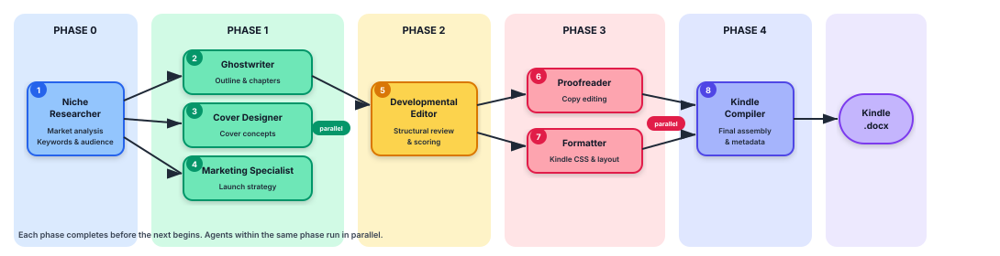

# Book Writer AI Agent Team

A multi-agent Kindle publishing pipeline powered by Claude. 8 specialized AI agents collaborate to take a book idea from raw concept to a publish-ready Kindle manuscript (.docx) — complete with market research, sample chapters, cover design briefs, marketing strategy, professional editing, formatting specs, and final compilation.

<p align="center">
  
</p>

---

## Table of Contents

- [The 8 Agents](#the-8-agents)
- [How It Works](#how-it-works)
- [Getting Started](#getting-started)
  - [Option A: Claude Code (Recommended)](#option-a-claude-code-recommended)
  - [Option B: CLI with Your Own API Key](#option-b-cli-with-your-own-api-key)
- [Pipeline Walkthrough](#pipeline-walkthrough)
- [Project Structure](#project-structure)
- [Configuration](#configuration)
- [Output](#output)
- [FAQ](#faq)

---

## The 8 Agents

| Phase | Agent | Role | What It Produces |
|:-----:|-------|------|------------------|
| 0 | **Niche Researcher** | Market analyst | Niche validation, keyword strategy, audience persona, competitive landscape |
| 1 | **Ghostwriter** | Author | Book outline, 2 full sample chapters, SEO metadata, Amazon listing copy |
| 1 | **Cover Designer** | Art director | 3 cover concepts with color palettes, typography, AI image prompts |
| 1 | **Marketing Specialist** | Growth strategist | Launch plan, Amazon Ads strategy, pricing, KPI dashboard |
| 2 | **Developmental Editor** | Structural editor | Scored review (structure/content/market fit), chapter-by-chapter feedback |
| 3 | **Proofreader** | Copy editor | Corrected manuscript, edit log, style report, fact-check flags |
| 3 | **Formatter** | Typesetter | Kindle CSS, interior design spec, chapter templates, QA checklist |
| 4 | **Kindle Compiler** | Final assembler | Collects your metadata, compiles everything into a Kindle-ready `.docx` |

Agents in the same phase run **in parallel**. The pipeline resolves dependencies automatically — no agent starts until its inputs are ready.

---

## How It Works

There are **two ways** to use this project:

### Option A: Claude Code (Recommended)

Use the agents directly inside [Claude Code](https://docs.anthropic.com/en/docs/claude-code). Claude reads each agent's system prompt and performs that role in conversation with you. This is the primary workflow — no API key management, no setup. Just describe your book idea in plain English and Claude handles the rest.

### Option B: CLI Pipeline

If you have your own `ANTHROPIC_API_KEY`, run the full pipeline from the terminal. All 8 agents execute automatically (parallel where possible) via the Anthropic API.

---

## Getting Started

### Option A: Claude Code (Recommended)

**Prerequisites:** [Claude Code](https://docs.anthropic.com/en/docs/claude-code) installed.

```bash
# 1. Clone the repo
git clone https://github.com/YOUR_USERNAME/book-writer.git
cd book-writer

# 2. Open in Claude Code
claude
```

**Usage — just describe your book idea in plain English:**

```
> I want to write a book about stoicism for software engineers
```

Claude will automatically:
1. Act as the **Niche Researcher** — explore the market with you interactively
2. Run each subsequent agent in pipeline order
3. Save outputs to `output/`
4. At the end, the **Kindle Compiler** will ask you for your book title, author name, and other metadata, then generate a `.docx` manuscript

> **Note on `@` file references:** The `CLAUDE.md` file in this repo contains workflow instructions that Claude Code reads automatically, so you do **not** need to use `@agents/...` references. Just describe what you want. If you prefer explicit control, you can optionally use `@` to attach a specific agent file to your prompt (e.g., `@agents/niche-researcher.md "my topic"`), but this is not required.

### Option B: CLI with Your Own API Key

**Prerequisites:** Python 3.10+, an [Anthropic API key](https://console.anthropic.com/).

```bash
# 1. Clone the repo
git clone https://github.com/YOUR_USERNAME/book-writer.git
cd book-writer

# 2. Set your API key
export ANTHROPIC_API_KEY="sk-ant-..."

# 3. Run the full pipeline (easiest)
./run.sh "stoicism for software engineers"
```

The `run.sh` script handles virtual environment creation, dependency installation, and execution automatically.

**Or set up manually:**

```bash
# Create virtual environment
python3 -m venv .venv
source .venv/bin/activate

# Install Python dependencies
pip install -r requirements.txt

# Install Node.js dependencies (for .docx generation)
npm install

# Run
python main.py "stoicism for software engineers"
```

**CLI options:**

```bash
# Use a faster/cheaper model
python main.py --model claude-haiku-4-5-20251001 "your topic"

# Run specific agents only (dependencies auto-included)
python main.py --select ghostwriter "your topic"
python main.py --select proofreader,formatter "your topic"

# List all agents
python main.py --list-agents

# Quiet mode (suppress progress logs)
python main.py --quiet "your topic"
```

---

## Pipeline Walkthrough

Here's what happens when you run the full pipeline:

### Phase 0 — Market Research

The **Niche Researcher** analyzes your book idea:
- Validates the niche (demand vs. competition)
- Builds a keyword strategy (primary + long-tail)
- Creates an audience persona (demographics, pain points, desires)
- Recommends a content angle and 3-5 title options
- Maps the competitive landscape (top 5 competing titles)

> In Claude Code, this phase is **interactive** — the researcher works with you to refine the niche before proceeding.

### Phase 1 — Creation (Parallel)

Three agents work simultaneously:

| Agent | Receives | Produces |
|-------|----------|----------|
| **Ghostwriter** | Research brief | Full outline, 2 sample chapters, Amazon listing copy |
| **Cover Designer** | Research brief | 3 cover concepts, color palettes, AI generation prompts |
| **Marketing Specialist** | Research brief | Launch strategy, Amazon Ads plan, pricing |

### Phase 2 — Structural Review

The **Developmental Editor** reviews the Ghostwriter's work:
- Scores structure, content strength, and market fit (1-10 each)
- Provides chapter-by-chapter feedback
- Flags critical issues vs. nice-to-have improvements

### Phase 3 — Polish (Parallel)

Two agents work simultaneously:

| Agent | Receives | Produces |
|-------|----------|----------|
| **Proofreader** | Chapters + dev edit | Corrected text, edit log, style report |
| **Formatter** | Blueprint + dev edit | Kindle CSS, interior specs, QA checklist |

### Phase 4 — Kindle Compilation

The **Kindle Compiler** runs last:

1. **Asks you for metadata:**
   - Book Title, Subtitle
   - Author Name (pen name)
   - Publisher / Imprint Name
   - Copyright Year
   - ASIN, ISBN (optional)
   - Dedication (optional)
   - About the Author bio
   - Also By (other titles, optional)

2. **Compiles everything** into a single Kindle-ready `.docx`:
   - **Front matter:** Title page, copyright page, dedication, table of contents
   - **Body:** All chapters (polished, with proper scene breaks)
   - **Back matter:** Author bio, also-by list, review request

3. **Applies Kindle-specific formatting** — no print specs, no embedded fonts, Heading 1 for TOC generation, proper indentation rules.

---

## Project Structure

```
book-writer/
├── agents/
│   ├── __init__.py          # Package exports
│   ├── definitions.py       # All 8 agent system prompts and configs
│   └── orchestrator.py      # Dependency-aware parallel pipeline runner
├── config/
│   └── __init__.py          # Model selection, output paths
├── output/                  # All generated content (gitignored)
│   ├── market_research.md
│   ├── ghostwriter.md
│   ├── cover_designer.md
│   ├── marketing_specialist.md
│   ├── developmental_editor.md
│   ├── proofreader.md
│   ├── formatter.md
│   ├── kindle_compiler.md
│   └── full_report.md
├── main.py                  # CLI entry point
├── run.sh                   # One-command runner (handles setup)
├── generate_cover.py        # Pillow-based cover image generator
├── generate_book.js         # Node.js book generation scripts
├── requirements.txt         # Python dependencies
├── package.json             # Node.js dependencies (docx)
├── CLAUDE.md                # Claude Code agent instructions
└── README.md                # You are here
```

---

## Configuration

### Model Selection

Edit `config/__init__.py` or pass `--model` on the CLI:

| Model | Speed | Quality | Cost |
|-------|-------|---------|------|
| `claude-opus-4-6` | Slowest | Best | $$$ |
| `claude-sonnet-4-5-20250929` | Fast | Great | $$ |
| `claude-haiku-4-5-20251001` | Fastest | Good | $ |

Default is `claude-opus-4-6`. For quick iterations, use Haiku:

```bash
python main.py --model claude-haiku-4-5-20251001 "your topic"
```

### Environment Variables

| Variable | Required | Description |
|----------|----------|-------------|
| `ANTHROPIC_API_KEY` | CLI mode only | Your Anthropic API key (`sk-ant-...`) |

Not needed when using Claude Code directly — it handles auth for you.

---

## Output

### Claude Code Mode

Each agent saves its output to `output/{agent_name}.md`. The final compiled manuscript goes to `output/kindle_manuscript.docx`.

### CLI Mode

Each run creates a timestamped directory:

```
output/run_20260208_143022/
├── niche_researcher.md
├── ghostwriter.md
├── cover_designer.md
├── marketing_specialist.md
├── developmental_editor.md
├── proofreader.md
├── formatter.md
├── kindle_compiler.md
├── full_report.md          # Combined markdown report
└── summary.json            # Run metadata (timing, model, etc.)
```

The `output/` directory is gitignored — your generated content stays local.

---

## FAQ

**Q: Do I need an API key?**
No — if you use Claude Code, it handles everything. You only need `ANTHROPIC_API_KEY` for the standalone CLI pipeline.

**Q: How long does the full pipeline take?**
Depends on the model. With Opus, expect several minutes. With Haiku, it's significantly faster. Parallel execution means phases 1 and 3 run their agents simultaneously.

**Q: Can I run just one agent?**
Yes. Use `--select`:
```bash
python main.py --select niche_researcher "my book idea"
```
Dependencies are auto-included — selecting `proofreader` will automatically run `niche_researcher`, `ghostwriter`, and `developmental_editor` first.

**Q: What format is the final manuscript?**
The Kindle Compiler produces a `.docx` file structured for direct upload to [KDP](https://kdp.amazon.com/). It includes proper front matter, body chapters, and back matter with Kindle-specific formatting (no print specs).

**Q: Do I need to use `@` file references in Claude Code?**
No. The `CLAUDE.md` file contains all the workflow instructions Claude needs. Just open the project in Claude Code and describe your book idea in natural language — Claude reads the agent prompts from `agents/` automatically. The `@` syntax is an optional shortcut for attaching specific files to your prompt, but it is not required.

**Q: Can I customize the agents?**
Yes. Each agent's behavior is defined by its `system_prompt` in `agents/definitions.py`. Edit the prompt to change what an agent produces.

**Q: Is this for print books too?**
The Formatter agent provides both Kindle and print specs. However, the final Kindle Compiler is Kindle-only — it strips all print-specific formatting (bleed, CMYK, spine calculations). The individual agent outputs in `output/formatter.md` still contain print specs if you need them.

---

## License

MIT
